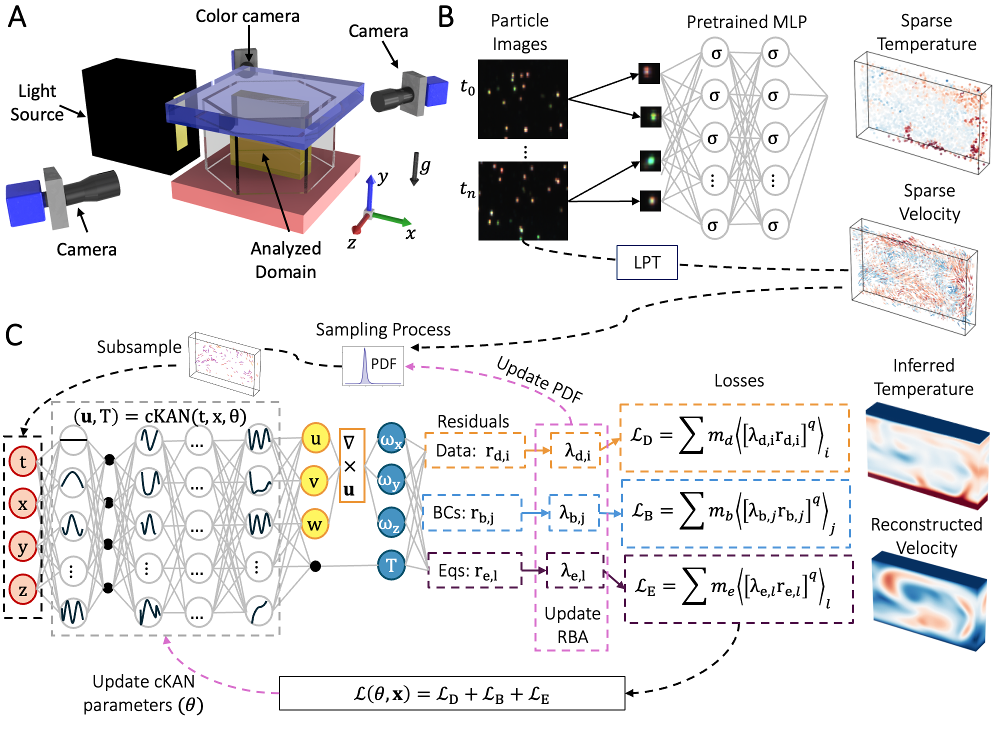

# Artificial-Intelligence-Velocimetry-Thermometry (AIVT)


This is the official implementation of the paper:  
**"AIVT: Inference of turbulent thermal convection from measured 3D velocity data by physics-informed Kolmogorov-Arnold Networks".**



We propose the **Artificial Intelligence Velocimetry-Thermometry (AIVT)** method to reconstruct a continuous and differentiable representation of temperature and velocity in turbulent convection from measured 3D velocity data. AIVT is based on **physics-informed Kolmogorov-Arnold Networks (cKANs)** and is trained by optimizing a loss function that minimizes residuals of the velocity data, boundary conditions, and governing equations. 

We apply AIVT to a **unique dataset** containing simultaneously measured 3D temperature and velocity data of Rayleigh-Bénard convection, obtained through a combination of **Particle Image Thermometry (PIT) and Lagrangian Particle Tracking (LPT)**. Unlike previous studies, our approach **directly compares machine learning results to true volumetric, simultaneous temperature and velocity measurements**. 

We demonstrate that AIVT can **reconstruct and infer continuous, instantaneous velocity and temperature fields and their gradients from sparse experimental data**, achieving a fidelity comparable to direct numerical simulations of turbulence. This provides a powerful new avenue for analyzing turbulence at **high Reynolds numbers**.

## References


1. **Toscano, J. D., Käufer, T., Wang, Z., Maxey, M., Cierpka, C., & Karniadakis, G. E. (2025).** AIVT: Inference of turbulent thermal convection from measured 3D velocity data by physics-informed Kolmogorov-Arnold networks. *Science Advances*, *11*(19). DOI: 10.1126/sciadv.ads5236
   **Link:** [Science Advances DOI: 10.1126/sciadv.ads5236](https://www.science.org/doi/10.1126/sciadv.ads5236)

If you find this content useful please consider citing out work as follows:

```bibtex
@article{toscano2025aivt,
  title={AIVT: Inference of turbulent thermal convection from measured 3D velocity data by physics-informed Kolmogorov-Arnold networks},
  author={Toscano, Juan Diego and K{\"a}ufer, Theo and Wang, Zhibo and Maxey, Martin and Cierpka, Christian and Karniadakis, George Em},
  journal={Science Advances},
  volume={11},
  number={19},
  year={2025},
  month={May},
  day={7},
  doi={10.1126/sciadv.ads5236},
  URL={https://www.science.org/doi/10.1126/sciadv.ads5236}
}
```


## Instructions

1. **Clone the repository**:
   ```sh
   git clone https://github.com/jdtoscano94/Instant-AIVT.git
   cd YOUR_REPO_FOLDER
   ```

2. **Download the dataset**:  
   The dataset is available [here](https://drive.google.com/file/d/1HXJGubY4J2TN4DOuhFA5pu_6A2rw7FgM/view?usp=drive_link).

3. **Move the data to the correct directory**:  
   ```sh
   mv path_to_downloaded_data ../Data/Rayleigh-Benard-Convection/
   ```

4. **Run our models using the provided Jupyter notebooks**.  
   The repository includes results for the following models:
   - **cKAN** with **149k parameters**  
   - **MLP** with **151k parameters**  
   - **MLP** with **282k parameters**  

   Each notebook contains all the necessary code to **replicate the results** presented in the paper. The results were generated using **JAX**, ensuring efficient computation with accelerated hardware support.

**Note:** To run these notebooks, you need the source files located in `../Instant_AIVT`. These files should be automatically downloaded when the project is cloned. Ensure that all dependencies are installed before executing the notebooks.
